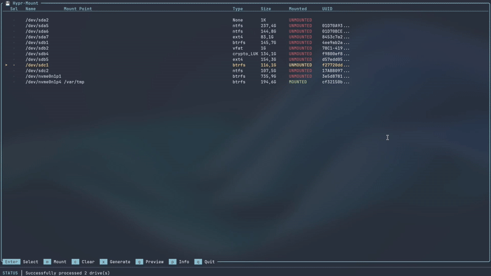

# hypr-mount

TUI for mounting drives with udisksctl and polkit integration.

## Features
- View available drives and partitions
- Mount/unmount drives with proper permissions
- Display drive information (name, size, type, UUID)
- Auto mounting configuration generation
- Detailed drive information popup
- Systemd service generation for automatic startup

## Installation
```bash
# Install dependencies
cargo build --release

# Install polkit rule for passwordless mounting
sudo ./hypr-mount.sh install

# Run the application
./hypr-mount.sh run
```

## Arguments
- `--auto-mount`: Auto mount drives based on config
- `--generate-service`: Create systemd service
- `--uncensor-uuid`: Show full UUIDs

## Keybinds
- `j`/`k` or Arrow keys: Navigate drives
- `Enter`: Select/unselect drive
- `m`: Mount/unmount selected drives
- `c`: Clear all selections
- `p`: Show drive information popup
- `g`: Toggle script preview
- `x`: Generate automount script in preview
- `q` or `Esc`: Quit or return to main view

## Demo


> **Disclaimer**: This is a hobby/training project, so updates or improvements may be infrequent. Use at your own discretion.

## Usage
After cloning and building:

Select drives with arrow keys/jk and Enter, then press `m` to mount/unmount.

For auto mounting:
Select drives, press `g` for config preview, then `x` to save the configuration.
Run with `--auto-mount` to mount drives automatically.

To generate systemd service:
Use `--generate-service` to create startup service file.
